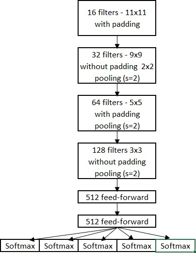
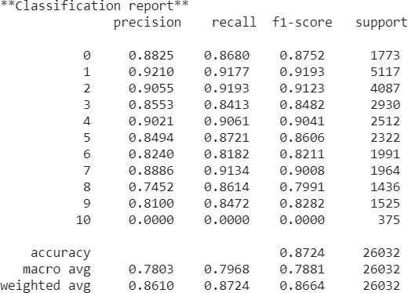

# Street-View-House-Numbers-Recognition

## Requirements
This repository is tested with Python 3.6+ and tensorflow==1.13.1

## Abstract
This document defines, explains and demonstrates results of a model for image recognition of multi- digit numbers through a widely used approach of Deep Learning.

## 1. Model Design
The purpose of this paper is to perform classification task on the Street View House Numbers dataset [1]. 
The dataset contains random images of house numbers which are vary in size, angles that the shot was taken, position etc. 
There were many approaches made during past years to solve this problem. Some approaches used techniques such as localization
to find where are the digits located and after that applied deep learning techniques to classify them. One other technique 
was quite different from those techniques and still considered state-of-art for this dataset [2]. This paper will describe 
their work briefly and follow their path. Rather then using another technique for detecting the location of digits they used 
only convolutional layers, feed forward network connected to parallel softmax layers. The model presented in this paper starts with downloading the full-size images with its link. Then the train and test files extracted to the working directory. Both files not only contain images but also the information about images in a file called digitStruct.mat. That file contains the relevant information about the bounding boxes that used to localize the image to find its location, its name and its label. The bounding box informations are distance from the top and the left of the picture also the height and the width. They are extracted from the digitStruct file as well as the label and the name of the image and stored in an array. After that all bounding box information analyzed. All top, left, height and width information stored separately and then for left and top the minimum for width and height the maximum values found in order to crop the pictures with the biggest bounding box that any picture in the dataset have with that method the images didn’t lose any important information, irrelevant information decreased and computational power saved. Also, for staying on the safe side adjustment made before cropping to extend the bounding boxes. To save more computational time the only picture which have six digits removed from the training set which reduced a softmax layer and normalization took place which was the last step before images 
went into the model. 
In addition to that the architecture built also influenced from [3]. 
The architecture described in the [3] was resizing the image to 32x32x3 because of the GPU issues and was using 
3 convolutional layers. First convolution had 16 5x5 feature detectors connected to relu activation and had a dropout, 
second one is also 5x5 with 32 feature detectors with relu activation, 2x2 pooling with 2 stride and a dropout layer, 
third one is the same with second except it has 64 filters. In addition to that all the convolutional layers used padding
to preserve the size of the image and take more information from the edges. Then the last convolution layer connected to a 
fully connected feed forward network with 1024 neurons and a single layer and relu as an activation function which feeds the 
results to 5 separate softmax layers for classifying 5 digits. 
The architecture this paper presents (Figure.1) first followed the architecture described and later changed to create a 
better solution. The architecture has 4 convolutional layer connected to a fully connected feed forward network which has
two hidden layers It first uses 16 11x11 feature detector with padding to preserve the image size, connected to a relu activation
function and a dropout layer (0.5), than second convolutional layer had 32 9x9 feature detectors without padding, connected to a
maximum pooling layer with 2 strides. That pooling also has a dropout (0.5) which passes information to the third convolutional layer. 
That layer has 64 filters which has 5x5 size. Later third layer passes information to activation function relu and then to the pooling 
layer same as the other ones described previously which connected to a dropout (0.5). Fourth convolutional layer has 128 3x3 feature 
detectors without padding and as before connected to a relu activation function and pooling layer. Then the information that those 
layers gathered fed into the feedforward network with two hidden layers both have 512 neurons and 0.5 dropout. The last step is to 
construct 5 parallel softmax layers for predicting digits. First softmax layer for first digit, second for second digit and so on. 
If there is no digit to predict the output was indented to be 10. Different hyperparameter settings were tried, lambda for regularization,
learning rate and dropout was chosen 0.05, 0.05 and 0.5 respectively. The images resized to 64x64x3 to get more information from them.
At the start of the model image fed in to the first layer and output had the same size, then after second layer the feature maps size
reduced to 28 then after third layer to 14 and before going into the fully connected network there was 13x13x128 feature maps.

## 2. Results
### <i> A. The architecture of the influenced model </i>
The architecture presented in [3] trained and evaluated. The model reached 82% accuracy on test set however on 
training the accuracy and loss was around %96 and 0.7 respectively which was a clear indicator of overfitting.
Also for normalization the mean and standard deviation calculated separately for both sets which leaked information 
to the test dataset.  

 

<i>Figure 1. Proposed Architecture</i> 
### <i> B.	The proposed architecture </i>
The proposed architecture trained and evaluated. With the aid of the Google Colab the training took approximately one hour. The loss decreased till 1.9, the accuracy and f1 score was 87% and 86% respectively. Especially adding one more convolutional layer improved the accuracy since more information was taken from images. With the change of the hyperparameters and adding another layer to the feed forward made the network gather more information and made it possible to decrease the loss and increase both accuracy and f1score. As seen in the classification report especially for roundish numbers 3,6 and 8 the model can predict better when they are actually that numbers (recall) but can easily get confused them with other ones (precision). So, the reason behind slightly worse f1 scores on that numbers are precision rather than recall. First intention is to build a bigger model with more convolutional layers however on a laptop even with the help of Google Colab bigger models got “exhausted” errors.  

 
<i>Figure 2. Results</i> 
## 3. Conclusion
The purpose of this project to get close to the state-of-art with a similar structure. However, when bigger models build such as a model similar to AlexNet the GPU power of the laptop at hand was not enough even with Google Colab. Even if the criteria don’t meet this model succeeded its predecessor
[3] and got better results. Future work can be building a bigger model or rebuilding the models that proven to be good at image processing and work more to solve the “exhausted” problem to get better results.
  
# References
[1]	Yuval Netzer, Tao Wang, Adam Coates, Alessandro Bissacco, Bo Wu, Andrew Y. Ng Reading Digits in Natural Images with Unsupervised Feature Learning NIPS Workshop on Deep Learning and Unsupervised Feature	Learning	2011	Retrieved	from http://ufldl.stanford.edu/housenumbers  
[2]	Goodfellow, Ian J., et al. "Multi-digit number recognition from street view imagery using deep convolutional neural networks." arXiv preprint arXiv:1312.6082 (2013).  
[3]	https://github.com/VladislavPrh/MDR/K.  

